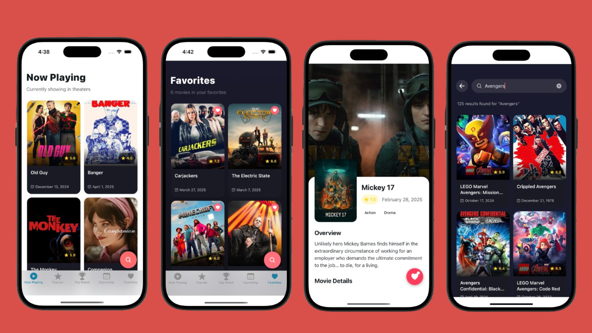

# TMDB Movies App

A React Native mobile application that allows users to discover, search, and save their favorite movies using The Movie Database (TMDB) API.



## Features

- Browse movies across different categories:
  - Now Playing
  - Popular
  - Top Rated
  - Upcoming
- Search movies by title, actor, or genre
- View detailed movie information including:
  - Plot overview
  - Rating and release date
  - Original language
  - Popularity metrics
- Save favorite movies for quick access
- Modern UI with smooth animations
- Dark theme optimized design

## Tech Stack

- React Native with Expo
- TypeScript
- Expo Router for navigation
- Context API for state management
- AsyncStorage for local data persistence
- TMDB API for movie data
- React Native Reanimated for animations

## Setup

1. Install dependencies

```bash
npm install
```

2. Create a .env file in the project root and **_use the API key I shared in the email_**:

```bash
EXPO_PUBLIC_API_TOKEN=your_tmdb_api_token
```

3. Start the development server

```bash
npx expo start
```

## Project Structure

```md
app/
  ├── (tabs)/           # Tab-based navigation screens
  ├── movie/            # Movie detail screens
  ├── search/           # Search functionality
  └── _layout.tsx       # Root layout configuration
components/             # Reusable UI components
context/                # Application state management
  ├── MovieContext.tsx
  ├── SearchContext.tsx
  └── FavoritesContext.tsx
api/
  └── movie.ts         # TMDB API integration
```

## Development Notes

- Uses TMDB API v3
- Implements debounced search
- Supports infinite scrolling
- Handles offline data persistence
- Optimized image loading

## Credits

- Movie data provided by [TMDB](https://www.themoviedb.org)
- Icons from Expo Vector Icons

## License

MIT License
